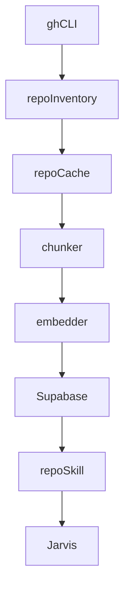

# Jarvis Repo Knowledge Plan

## Summary

We will inventory repairman29 repos via the authenticated `gh` CLI, build a local cache and chunked index, generate local embeddings (Ollama), store vectors + metadata in Supabase, and add a new skill so Jarvis can answer cross-repo questions with citations, summaries, and repo-aware suggestions. We will also schedule refresh and add “index freshness” checks to the Safety Net.

## Assumptions

- `gh` CLI is already authenticated on this machine.
- Supabase project is the one referenced in `SUPABASE_MCP_SETUP.md`.
- Local embeddings will be via Ollama (e.g. `nomic-embed-text`).

## Key Existing References

- Supabase guidance: [C:/Users/jeffa/JARVIS/JARVIS/SUPABASE_MCP_SETUP.md](C:/Users/jeffa/JARVIS/JARVIS/SUPABASE_MCP_SETUP.md)
- Ops/tooling conventions: [C:/Users/jeffa/JARVIS/JARVIS/jarvis/TOOLS.md](C:/Users/jeffa/JARVIS/JARVIS/jarvis/TOOLS.md)
- Agent behavior: [C:/Users/jeffa/JARVIS/JARVIS/jarvis/AGENTS.md](C:/Users/jeffa/JARVIS/JARVIS/jarvis/AGENTS.md)
- Safety Net docs: [C:/Users/jeffa/JARVIS/JARVIS/docs/JARVIS_SAFETY_NET.md](C:/Users/jeffa/JARVIS/JARVIS/docs/JARVIS_SAFETY_NET.md)

## Architecture (Proposed)

## Plan

1. **Inventory & existing tooling audit**
  - Use `gh repo list repairman29 --json name,sshUrl,visibility,updatedAt` to build `repos.json`.
  - Scan the listed repos for existing indexing/RAG tooling (user mentioned some already exists). If found, reuse and standardize rather than rebuild.
2. **Supabase schema for repo knowledge**
  - Create a SQL migration (new file) for tables:
    - `repo_sources` (repo metadata)
    - `repo_files` (path, sha, size, language)
    - `repo_chunks` (chunk text, embedding vector, repo_id, file_id, offsets)
    - `repo_summaries` (repo-level summary, last_indexed)
  - Enable `pgvector` extension and create vector indexes for similarity search.
  - Apply via Supabase MCP SQL tool.
3. **Repo indexer script (local cache + embeddings)**
  - New script `scripts/index-repos.js`:
    - Clone/update repos into `~/.jarvis/repos-cache` (or configurable path).
    - Extract key files: README, docs, package.json, key source directories.
    - Chunk content, generate embeddings using local Ollama (`http://localhost:11434/api/embeddings`).
    - Upsert into Supabase tables.
    - Record `last_indexed` and index stats.
4. **Jarvis skill for repo knowledge**
  - New skill (e.g. `skills/repo-knowledge/`):
    - `repo_search(query, repo?)` → semantic search across `repo_chunks`.
    - `repo_summary(repo)` → summary from `repo_summaries`.
    - `repo_file(repo, path)` → fetch file references and top chunks.
    - `repo_map(repo)` → repo-level structure highlights.
  - Uses Supabase client + env vars in `%USERPROFILE%\.clawdbot\.env`.
5. **Update agent/tooling docs**
  - Add the new skill to [C:/Users/jeffa/JARVIS/JARVIS/jarvis/TOOLS.md](C:/Users/jeffa/JARVIS/JARVIS/jarvis/TOOLS.md).
  - Add guidance in [C:/Users/jeffa/JARVIS/JARVIS/jarvis/AGENTS.md](C:/Users/jeffa/JARVIS/JARVIS/jarvis/AGENTS.md) to use repo-knowledge tools for cross-repo questions.
6. **Scheduling + Safety Net integration**
  - Add Task Scheduler script to run `scripts/index-repos.js --refresh` nightly.
  - Extend Safety Net to check index freshness and alert if stale.

## Validation

- Run `scripts/index-repos.js --dry-run` on 2–3 repos.
- Query with `repo_search` and confirm citations match actual files.
- Confirm Supabase tables populate and similarity search returns relevant chunks.
- Verify Safety Net alerts when index is stale.

## Open Questions (resolved by prior answers)

- Access: `gh` CLI authenticated.
- Storage: Supabase.
- Embeddings: local (Ollama).

## Risks

- Local embeddings require Ollama running; we’ll add a preflight check and clear error message.
- Supabase vector limits and cost; chunking size and filtering will be tuned.

## Next Actions

- I will locate any existing repo-indexing tooling in the repairman29 repos and re-use it where possible, then draft the schema and indexer script.

